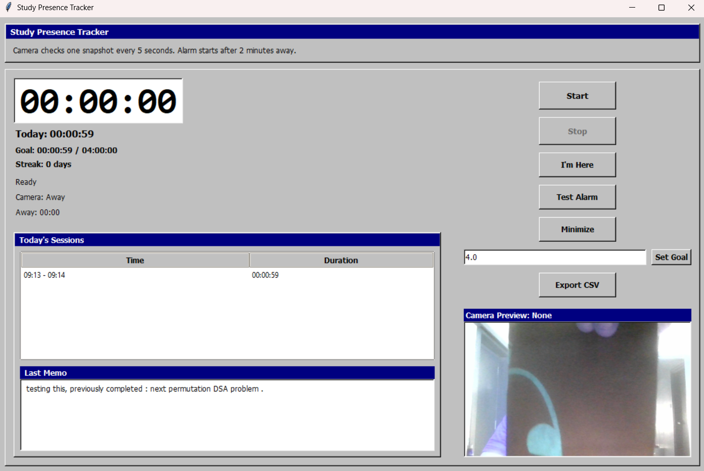

# Study Presence Tracker

A polished Windows study timer with webcam-based presence detection, instant pause-on-away, memo tracking, and a compact dashboard widget.


Alarm : Zinda (from Bhaag Milkha Bhaag)

## What it does

Study Presence Tracker turns your Windows PC into a smart study assistant:

- Automatically detects your presence using webcam face/body detection.
- Pauses the study timer after 2 minutes away and plays an alarm.
- Keeps a clean session history with timestamps, duration, and memo notes.
- Supports a compact always-on-top widget when the dashboard is minimized.
- Exports study sessions to CSV for review or journaling.

## Why it’s useful

- Stay focused: the timer only counts while you’re actually present.
- Prevent lost study time with an automatic away pause.
- Keep accountability with a required session memo.
- Track daily goals and study streaks at a glance.
- Run it anywhere: bundled as a self-contained Windows executable.

## Ready-to-run Windows package

A standalone Windows executable is already built at:

- `dist\StudyPresenceTracker.exe`

This file is the installable/portable version for Windows. Copy it to any modern Windows PC and run it directly.

> Tip: If you want to preserve your study history, keep `study_tracker.db` in the same folder as the executable.

## Run it now

1. Open the `dist` folder.
2. Double-click `StudyPresenceTracker.exe`.
3. Start a session, minimize to widget mode, and let the app track your focus.

## Build your own package

If you prefer to rebuild from source:

```powershell
.venv\Scripts\python.exe -m pip install -r requirements.txt
.\build_exe.bat
```

This produces the same standalone executable in `dist\StudyPresenceTracker.exe`.

## Features

- Webcam presence detection with OpenCV YuNet + fallback cascade detection
- Compact widget minimizes the full dashboard while keeping controls visible
- Weekly and monthly performance charts with averages and goal attainment
- Important study statistics shown in a separate analytics window
- Automatic two-minute away grace period with alarm activation
- Manual "I’m Here" reset for missed detection
- Daily goal tracking and streak reporting
- CSV export of saved sessions
- Local SQLite history storage for persistence

## Included files

- `study_presence_tracker.py` — main app logic
- `study_services.py` — goal tracking, streaks, and export support
- `build_exe.bat` — build script for generating the portable `.exe`
- `StudyPresenceTracker.spec` — PyInstaller spec
- `face_detection_yunet_2023mar.onnx` — face detection model
- `Zinda Bhaag Milkha Bhaag 128 Kbps.mp3` — alarm audio
- `study_tracker.db` — local session history database (created automatically)
- `image.png` — screenshot of the app interface

## Notes

- The built executable is self-contained and designed for Windows.
- The app requires a webcam for presence sensing.
- Keep the `.db` file in the same directory if you want to save and review history across runs.
